# Impactful Sequences

# CHADOX1

## CHADOX1 (30k seq)

:::: {.columns}
::: {.column width="55%"}
- Viral vector vaccine: for Covid-19
- Adenovirus-based
- Delivers spike protein gene to muscle cells
- Spike protein processed into antigens
- B cells make antibodies; T cells target infected cells
- Antibodies and T cells attack infected lung cells
:::
::: {.column width="45%" .figstack}
[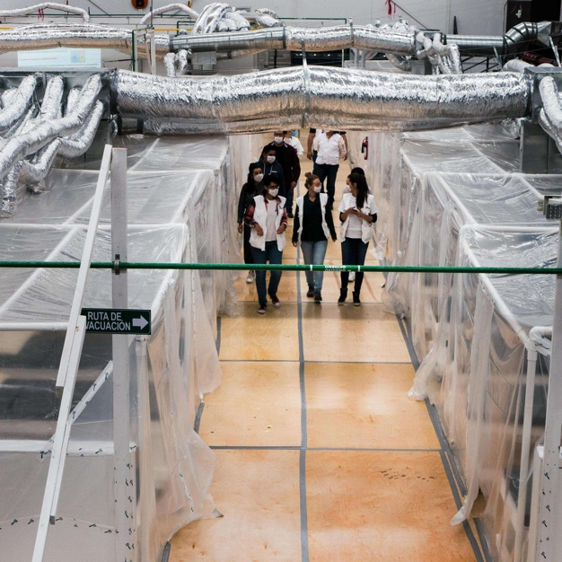](https://www.doctorswithoutborders.org/latest/msf-begins-treating-covid-19-patients-tijuana-mexico)

[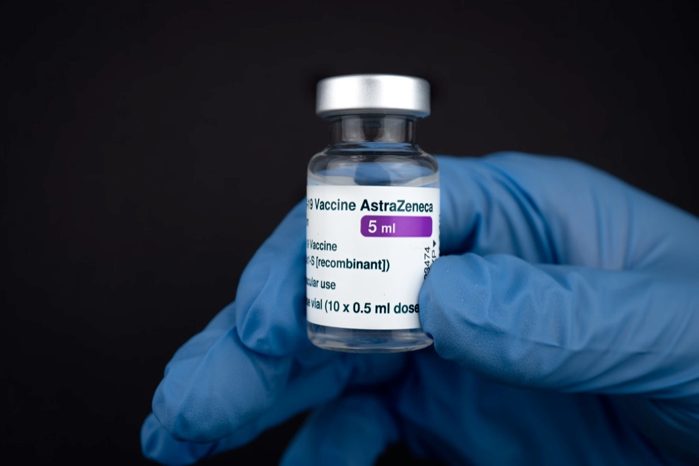](https://unsplash.com/photos/vitamin-b-12-100-mg-Mtu3Rd1-OBI?utm_content=creditCopyText&utm_medium=referral&utm_source=unsplash)

::: {.figspot}
[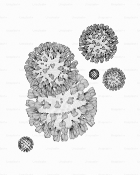](https://unsplash.com/photos/a-black-and-white-drawing-of-a-bunch-of-flowers-UqtjccD6H3o)
:::
:::
::::

::: {.cite}
[Sarah Gilbert et al. (2021)](https://doi.org/10.1016/S0140-6736(20)32661-1)
:::

# J07BN01

## J07BN01 (4k seq)

:::: {.columns}
::: {.column width="52%"}
- Lipid nanoparticles: from cellular liposomes
- mRNA: encodes spike protein
- Delivery: crosses cell membrane
- Immune response: processed by APCs
- Outcome: infected cells destroyed
:::
::: {.column width="48%" .figstack}
[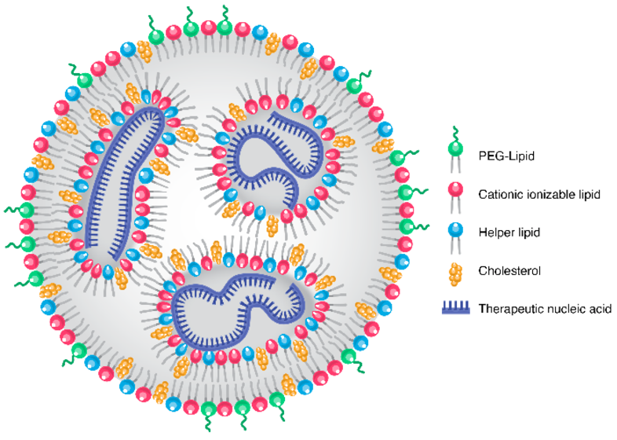](https://www.mdpi.com/1424-8247/15/7/897)

:::
::::

::: {.cite}
[Ozlem Tureci et al. (2021)](https://www.nejm.org/doi/full/10.1056/NEJMoa2034577)
:::

# M09AX15

## M09AX15 (5k seq)

:::: {.columns}
::: {.column width="58%"}
- Duchenne muscular dystrophy is a severe progressive disease
- Caused by deletions/mutations to 79 exons of a gene
- Elevidys rAAV Gene Therapy
:::
::: {.column width="42%" .figstack}
[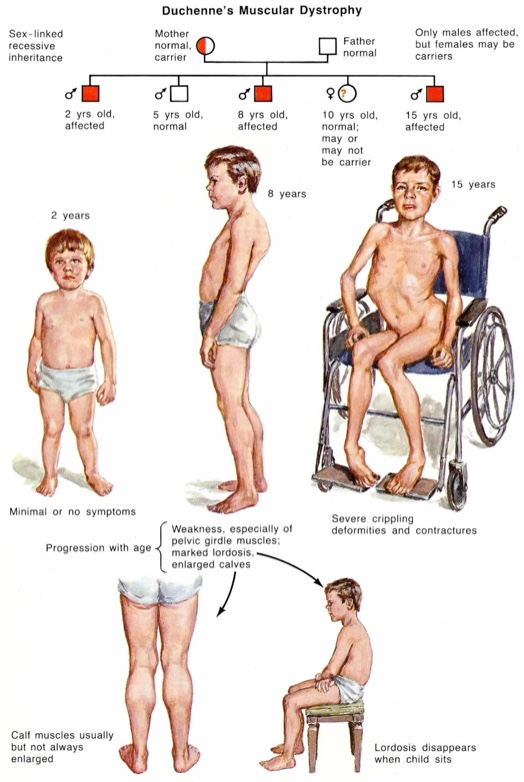](https://healthjade.net/duchenne-muscular-dystrophy/)

[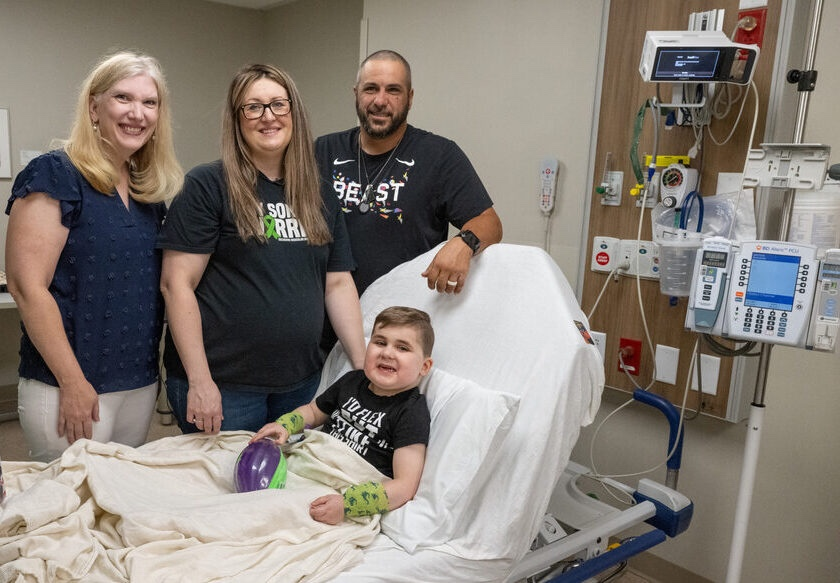](https://www.akronchildrens.org/inside/2023/08/07/akron-childrens-patient-is-among-first-to-receive-life-changing-gene-therapy-for-duchenne-muscular-dystrophy-after-fda-approval/)
:::
::::

::: {.cite}
[Hwu (2024)](https://doi.org/10.1186/s12929-024-01070-1)
:::

# L01FF02

## L01FF02 (1k seq)

:::: {.columns}
::: {.column width="58%"}
- Cancer: uncontrolled spread
- Keytruda: humanized antibody
- Source: mouse antibodies
- Action: blocks immune checkpoints, enables T-cells
- Use: melanoma, including brain (e.g., Jimmy Carter)
:::
::: {.column width="42%" .figstack}

:::
::::

::: {.cite}
[Emancipator (2020)](https://doi.org/10.1208/s12248-020-00525-1)
:::

# Gene Therapy\*

## Gene Therapy

:::: {.columns}
::: {.column width="40%"}
- Gene Therapy: fixes faulty genes
- Goal: cure genetic disorders
- Methods:
    - add genes
    - modify genes
    - silence genes
- Uses: hereditary diseases, cancer

[!!!VIRUSES ARE GREAT TRANSPORTS TO HUMAN CELLS!!!]{.bang}
:::
::: {.column width="60%" .figstack}
[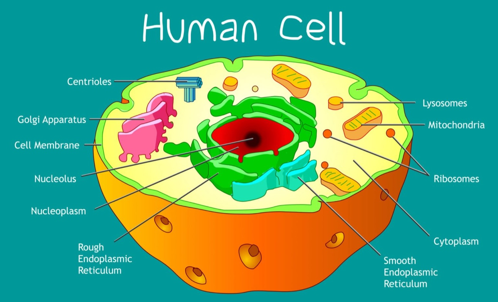](https://www.biologyonline.com/tutorials/cell-structure)

[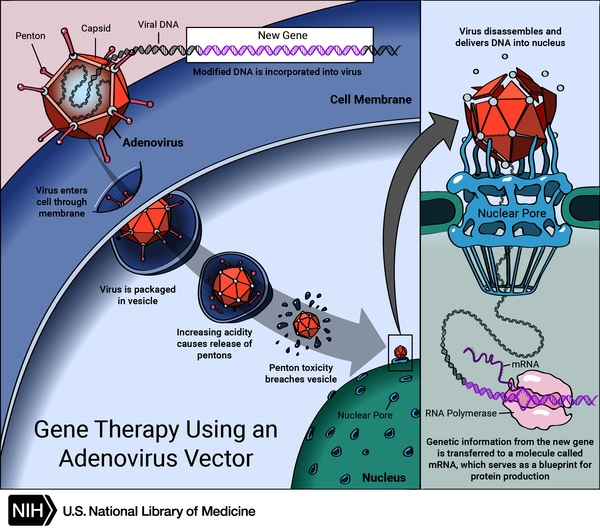](https://medlineplus.gov/genetics/understanding/therapy/procedures/)
:::
::::

::: {.cite}
[Sadelin et al. (2018)](https://www.science.org/doi/10.1126/science.aan4672)
:::

# Adeno Associated Virus (rAAV) Therapy

## What is a Virus?

:::: {.columns}
::: {.column width="55%"}
A sequence of DNA/RNA housed inside a protein shell

- Definition: infectious agents requiring host cells
- Size: 1kb to 30kb
- Reproduction: inside host cells
- Types: DNA, RNA
- Transmission: various routes
- Impact: disease-causing
- Evolution: mutations, recombination

[A system defined by its information & replication dynamics]{.bang}
:::
::: {.column width="45%" .figstack}
[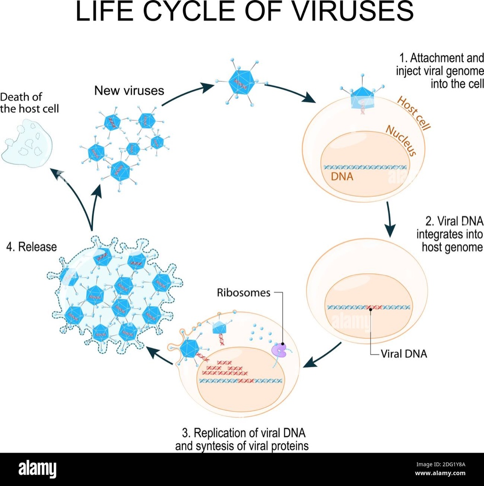](https://www.alamy.com/stock-photo/viral-life-cycle.html?sortBy=relevant)

[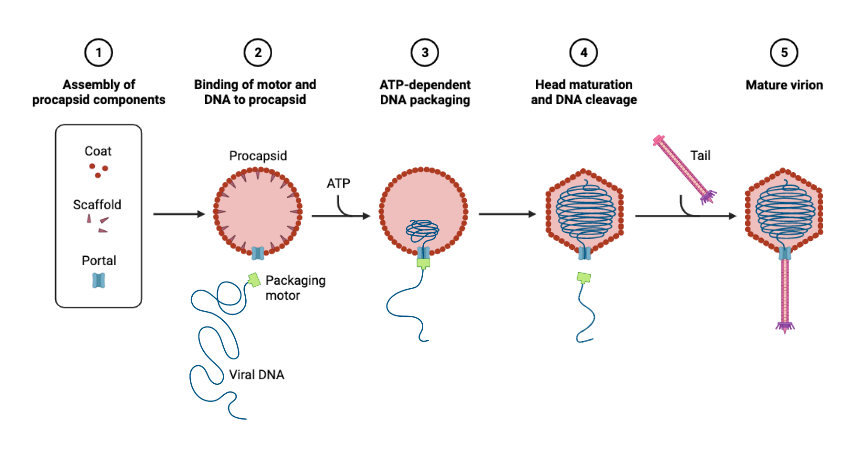](https://www.biorender.com/template/viral-genome-packaging)
:::
::::

## Adenovirus

:::: {.columns}
::: {.column width="46%"}
- Common cold virus
- GOOD vaccines:
    - efficient delivery
    - strong immune response
    - proven, like covid-19
- BAD gene therapy:
    - limited capacity
    - pre-existing immunity
    - potential inflammation
:::
::: {.column width="54%" .figstack}
[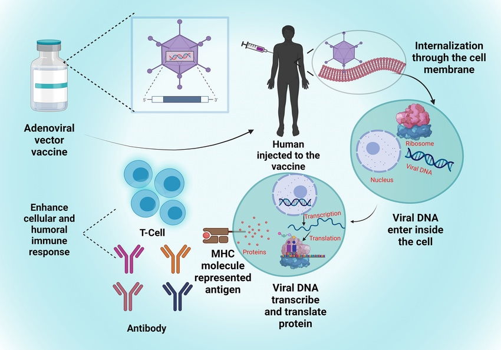](https://www.researchgate.net/figure/Schematic-diagram-representing-the-mechanism-of-the-adenovirus-vaccine-Viral-vectored-or_fig2_377974310)

[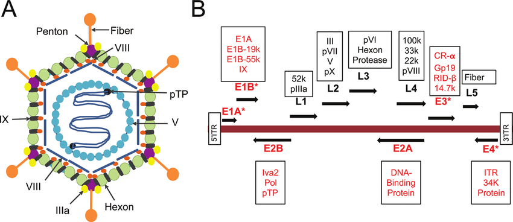](https://www.researchgate.net/figure/Adenovirus-structure-and-genome-organization-A-Graphical-representation-of-adenovirus_fig1_328875899)
:::
::::

::: {.cite}
[Tollefson et al. (1999)](https://link.springer.com/content/pdf/10.1007/978-1-59745-277-9.pdf)
:::

## Adeno Associated Virus

:::: {.columns}
::: {.column width="55%"}
- AAV Genome: single-stranded DNA virus
- Components: two genes (rep and cap)
- Rep Gene: viral replication and packaging
- Cap Gene: capsid proteins
- Payload: up to 5kb of therapeutic genes
- Advantages: low immunogenicity, long-term expression
:::
::: {.column width="45%" .figstack}
[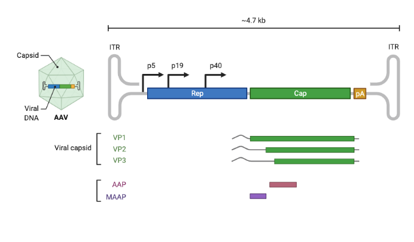](https://www.dynotx.com/introduction-to-aav-as-a-gene-therapy-vector-part-1/)

[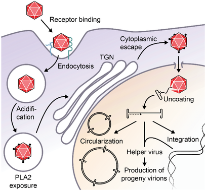](https://www.researchgate.net/figure/Model-of-AAV-infection-Upon-binding-to-its-cellular-receptors-AAV-is-internalized-by_fig2_349633421)
:::
::::

::: {.cite}
[Linden et al. (2011)](https://link.springer.com/protocol/10.1007/978-1-61779-370-7_1)
:::

## AAV Approved Medicines

:::: {.columns}
::: {.column width="50%" .figstack .fill}
[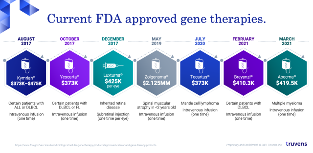](https://truveris.com/cell-gene-therapy-payer-considerations/)
:::
::: {.column width="50%" .figstack .fill}
[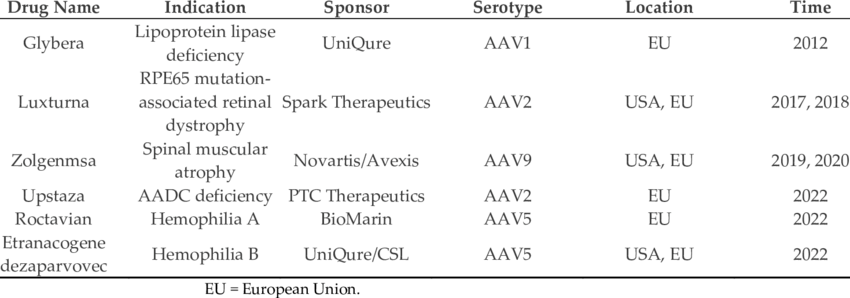](https://www.researchgate.net/figure/List-of-approved-AAV-gene-therapy-drugs-EU-European-Union_tbl1_367468761)
:::
::::

::: {.cite}
[Listgarten et al. (2024)](https://www.science.org/doi/full/10.1126/sciadv.adj3786)
:::

# Improving On Nature

## Viral Vector Gene Therapy: Problems

- **Immunogenicity**: immune response can reduce efficacy
- **Limited payload**: small capacity for therapeutic genes
- **Pre-existing immunity**: common viruses can be recognized and attacked
- **Insertional mutagenesis**: risk of disrupting host genes
- **Production costs**: expensive and complex manufacturing processes

::: {.cite}
[Segurado (2024)](https://onlinelibrary.wiley.com/doi/abs/10.1002/9781119852810.ch1)
:::

## Solver: Machine Directed Evolution

:::: {.columns}
::: {.column width="45%" .figstack}
[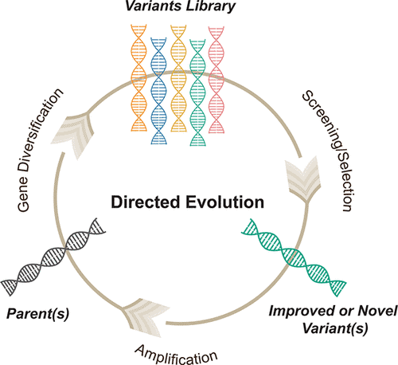](https://www.zmescience.com/feature-post/natural-sciences/biology-reference/genetics/directed-evolution-tailoring-proteins-enzymes-and-life/)
:::
::: {.column width="55%" .figstack}
[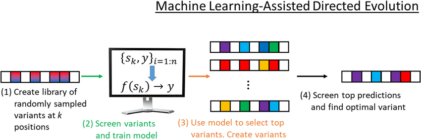](https://www.researchgate.net/figure/Machine-learning-assisted-directed-evolution-The-first-step-in-ML-assisted-DE-is-the_fig2_352900464)

[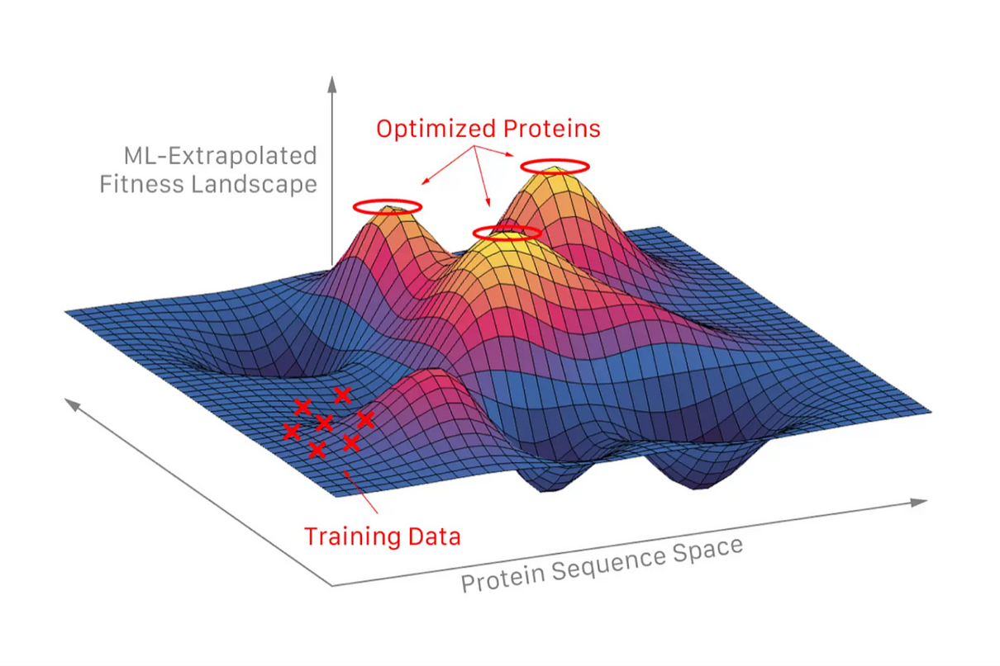](https://medium.com/@axialxyz/machine-learning-guided-mutagenesis-fd661babd38d)
:::
::::

::: {.cite}
[Arnold et al. (2009)](https://www.ncbi.nlm.nih.gov/pmc/articles/PMC2997618/pdf/nihms251972.pdf)
:::

## Central Dogma of Molecular Biology

:::: {.columns}
::: {.column width="50%" .figstack}
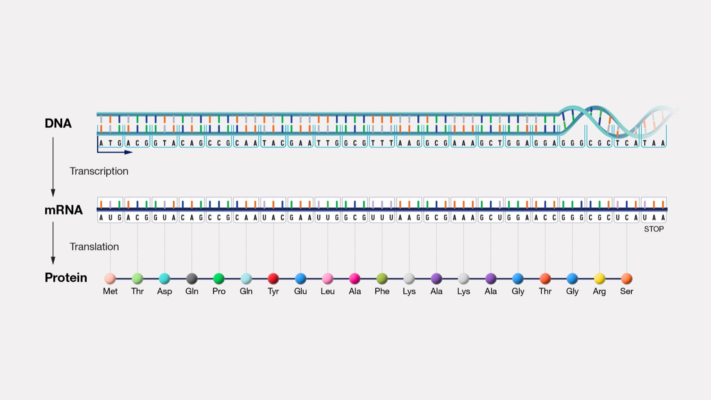
:::
::: {.column width="50%" .figstack}
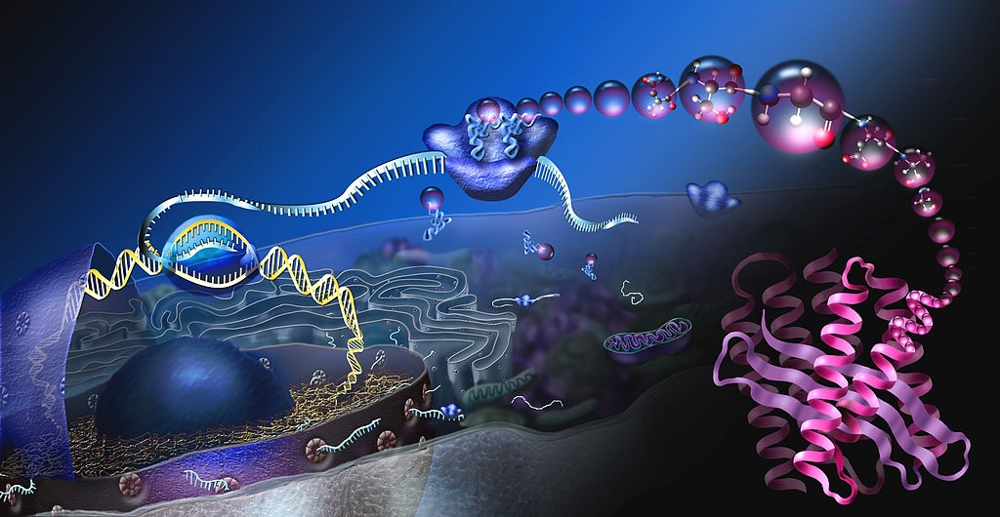
:::
::::

::: {.cite}
[Crick (1970)](https://www.nature.com/articles/227561a0)
:::

## AAV Sequencing Workflow

:::: {.columns}
::: {.column width="52%" .tight}
- `fastqc`: Check quality of raw sequencing data
- `trimmomatic`: Trim adapters and low-quality sequences
- `bwa mem`: Align reads to reference genome
- `samtools view -bS`: Convert SAM to BAM format
- `bedtools coverage`: Calculate read coverage over regions
- `bcftools call`: Call variants from BAM files
- `grep`, `awk`, `cut`: Extract and manipulate data from files

[GENOME SEQUENCE => FITNESS]{.bang}
:::
::: {.column width="48%" .figstack}
[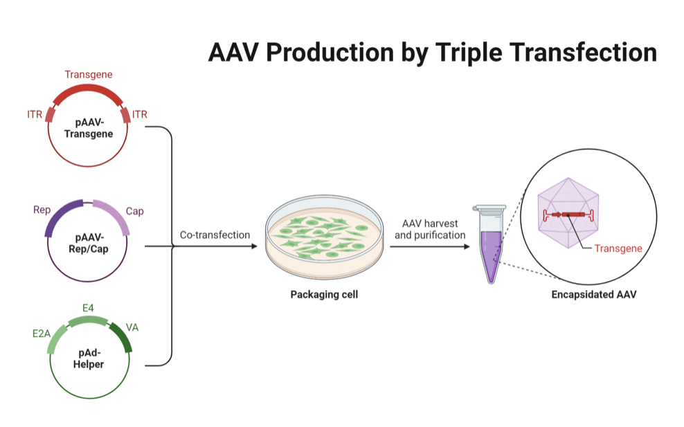](https://www.biorender.com/template/aav-production-by-triple-transfection)

[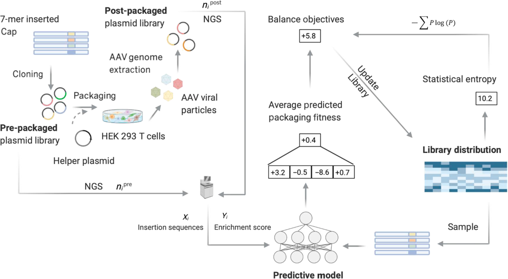](https://www.science.org/doi/10.1126/sciadv.adj3786)
:::
::::

::: {.cite}
[Church et al. (2019)](https://www.ncbi.nlm.nih.gov/pmc/articles/PMC7197022/)
:::

# How?

## AAV Genome Modules

::: {.fig-full}
[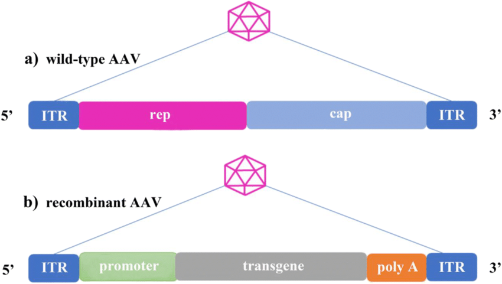](https://www.researchgate.net/figure/Genome-structure-of-a-wild-type-AAV-and-b-recombinant-AAV-The-genome-of-wild-type_fig2_346533357)
:::

::: {.cite}
[Volckov et al. (2023)](https://www.cell.com/heliyon/fulltext/S2405-8440(23)02278-8)
:::

## Capsid

:::: {.columns}
::: {.column width="62%"}
Protein shell protecting the genome

- Structure: 60 capsomers (VP1, VP2, VP3 proteins)
- Function: genome protection, cell entry
- Variability: different serotypes have unique proteins
- Engineering: modified for targeting and immune suppressing

[!!!60 Points of Symmetry!!!]{.bang} Icosahedral shape, with internal 5 and 3 symmetry points
:::
::: {.column width="38%" .figstack}
[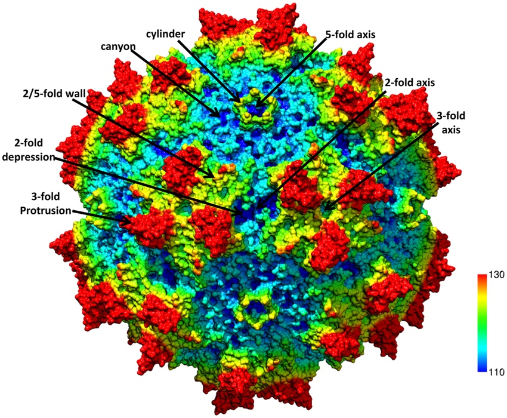](https://www.researchgate.net/figure/The-AAV-capsid-Radially-color-cued-from-capsid-center-to-surface_fig1_260170592)
:::
::::

::: {.cite}
[Kalia and Rabinowitz (2023)](https://insights.bio/cell-and-gene-therapy-insights/journal/article/2885/Fine-tuning-AAV-machine-learning-the-capsid)
:::

## Promoter

:::: {.columns}
::: {.column width="50%"}
- Regulates gene expression
- DNA region that initiates transcription
- Binds RNA polymerase and transcription factors
- Interaction: TFBMs in promoters control gene expression
:::
::: {.column width="50%" .figstack}
[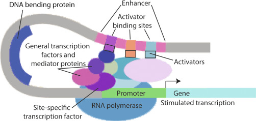](https://www.sciencedirect.com/topics/neuroscience/transcription-factors)
:::
::::

::: {.cite}
[Kundaje et al. (2023)](https://www.biorxiv.org/content/biorxiv/early/2019/08/21/737981.full.pdf?ref=https://githubhelp.com)
:::

## Inverted Terminal Repeats

:::: {.columns}
::: {.column width="55%"}
Repeated sequences at both ends of the AAV genome, with secondary structure symmetry

- Essential for
    - packaging
    - genome encapsidation
    - replication

but 2-mers 'CG' are inflammatory
:::
::: {.column width="45%" .figstack}
[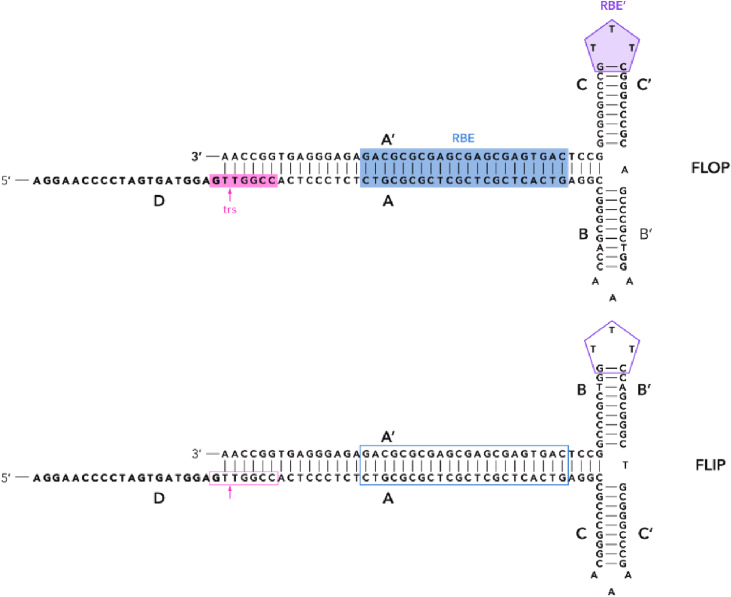](https://www.sciencedirect.com/science/article/pii/S2405844023022788)
:::
::::

::: {.cite}
[Logan et al. (2019)](https://www.liebertpub.com/doi/abs/10.1089/hgtb.2019.276)
:::

## Infeasible: Search Space

:::: {.columns}
::: {.column width="58%"}
> "Biochemistry disrupts Machine Learning" --- Jennifer Listgarten

- AAV: 4.5 kb long
- Protein sequence: 20 amino acids per position
    - 60-length protein: 20\*\*60 possibilities
    - \>> atoms in the universe (~10\*\*80)
- Classifier/regressor can't label space
- Not enough lifetime/compute
:::
::: {.column width="42%" .figstack}
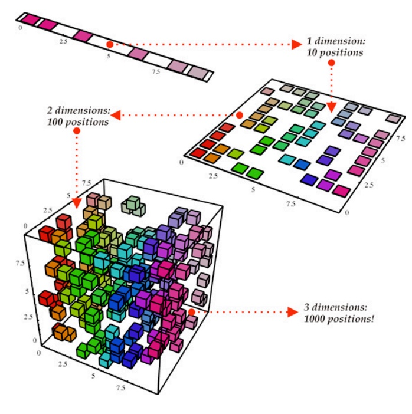
:::
::::

::: {.cite}
[Ihara et al. (2023)](https://www.sciencedirect.com/science/article/pii/S2949747723000088)
:::

## Discriminative vs Generative Learning

:::: {.columns}
::: {.column width="50%"}
**Discriminative Learning (DL)**

- Focus: models decision boundaries
- Objective: estimates $P(Y \mid X)$
- Examples: SVMs, CNN, NN, RF
:::
::: {.column width="50%"}
**Generative Learning (GL)**

- Focus: models data distributions
- Objective: estimates $P(X \mid Y)$ and $P(Y)$
- Examples: Naive Bayes, VAEs, Transformers
:::
::::

[!!!GL can work better when search space infeasible!!!]{.bang}

::: {.cite}
[Ng and Jordan (2001)](https://papers.nips.cc/paper_files/paper/2001/hash/7b7a53e239400a13bd6be6c91c4f6c4e-Abstract.html)
:::

## Generative Models with High Dimensional Data

- GANs
- Transformers
- Normalizing Flows
- VAEs
- Diffusion Processes
- Graph Neural Networks
- Energy Based Models

::: {.cite}
[Foster (2022)](https://github.com/davidADSP/Generative_Deep_Learning_2nd_Edition)
:::

## Machine Learning Ritual

Steps:

- Process raw data (Experimental data, NGS)
- Enrich with secondary data (Open source databases)
- Perform alignment
- Encode metadata, sequences, DNA counts, transcript counts
- Select candidate model
- Train on (input, output) pairs
- Generate novelty and/or predictions
- Validate predictions experimentally

::: {.cite}
[Alpaydin (2020)](https://mitpress.mit.edu/9780262043793/introduction-to-machine-learning/)
:::

## Capsid Engineering

Objective: Optimize capsids for gene delivery and therapeutic effect

- Improve multiple properties:
    - Target specific tissues
    - Evade immune response
    - Improve stability
    - Appropriate gene expression

## Capsid Engineering: Shuffling Wild Type

- Only 9 wild type capsids
- Different tissue & cell specificity
- Shuffling and expert opinion used in past to generate novel capsids
- ML difficult on 9 examples

::: {.fig-full}
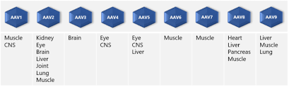
:::

::: {.cite}
[Grimm et al. (2018)](https://pubs.acs.org/doi/full/10.1021/acssynbio.8b00373)
:::

## Capsid Engineering: Machine Learning

:::: {.columns}
::: {.column width="62%"}
- Apply ML (EBM, RF, VAE, Transformers) for novel designs
- Generate multi-output predictions
- Single point mutations found amazing plethora of relationships including new gene

[FDA Guidance: less interest in novel capsids]{.bang}
:::
::: {.column width="38%" .figstack}
[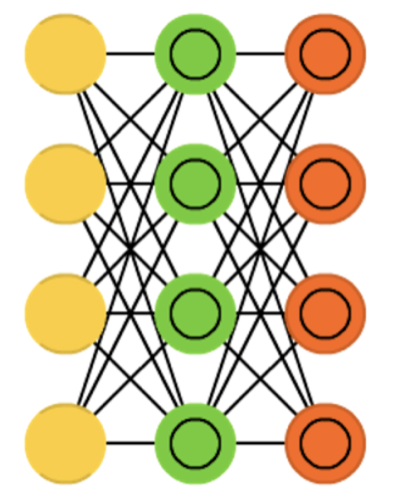](https://www.asimovinstitute.org/neural-network-zoo/)

[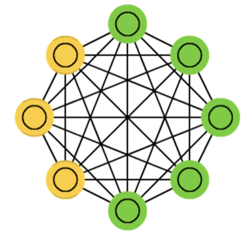](https://www.asimovinstitute.org/neural-network-zoo/)
:::
::::

::: {.cite}
[Schaffer et al. (2019)](https://www.sciencedirect.com/science/article/pii/S0958166918301423) and [Kelsic et al. (2021)](https://pubmed.ncbi.nlm.nih.gov/33574611/)
:::

## Promoter Engineering

:::: {.columns}
::: {.column width="62%"}
- Input promoter sequences
- Identify potential TFBMs using motif discovery tools
- Use ML models to predict/generate functional TFBMs
- Optimize sequences for improved binding
- Approaches being applied include clustering, density estimation, classification with Neural and Bayesian learning
- Transcription factors are used to compose promoters from open source and cell specific databases
:::
::: {.column width="38%"}
Tools

- HOMER
- HMMR
- bpNET
:::
::::

[FDA more inclined to permit DNA sequences of promoters, not proteins being injected into organs.]{.bang}

::: {.cite}
[Roberts (2011)](https://books.google.com.mx/books?id=qROeDwAAQBAJ&pg=PA375)
:::

## ITR Engineering

- Strong belief that 'CG' is immunogenic and should be depleted
- Different problem from promoter and capsid
- ITR must maintain the symmetries expected by different arms
- Need to generate ITRs that are different, but plausible compared to wild type
- Different, but not too different
- Looking for fitness gaps that nature missed
- lookup table and modifications that are distance preserving

::: {.cite}
[Duan et al. (2022)](https://www.nature.com/articles/s41434-021-00296-0)
:::

## Considerations

- Viruses can be engineered good
- Gene therapy is exciting and important technology
- Machine learning is a powerful tool for this
- Size of search space necessitates new approaches (Generative AI)
- Maybe use tools like Topological Data Analysis

# Questions
