# Four Sequences That Worked {.act .k-violet}

Four medicines that changed the last decade. Each depends on a deliberately chosen biological sequence.

## ChAdOx1: The Vector Was Already There {.k-violet}

:::: {.columns}
::: {.column width="52%"}
A chimpanzee adenovirus, gutted and reloaded.

- Spike gene swapped in for E1
- Replication-deficient
- Shipped at fridge temperature

[≈35 kb of DNA]{.metric}
:::
::: {.column width="48%"}
Billions of doses. The virus is the courier, not the medicine.

The **payload was written, not discovered** — a spike sequence pasted into a vector
backbone.
:::
::::

::: {.cite}
@voysey2021
:::

::: {.notes}
Start concrete and move fast. ChAdOx1 is a chimpanzee adenovirus precisely because human
adenovirus seroprevalence would neutralise it — already a hint of the immunology problem
that dominates the back half of this talk.

The thing to plant: the vector was off the shelf. What changed was the sequence dropped
into it, and that took days once the genome was published.
:::

## BNT162b2: The Courier Disappears {.k-violet}

:::: {.columns}
::: {.column width="52%"}
No virus at all. A sequence in a lipid droplet.

- Nucleoside-modified mRNA
- Lipid nanoparticle delivery
- Transient by design

[4,284 nucleotides]{.metric}
:::
::: {.column width="48%"}
Designed from a published genome in **days**.

::: {.portrait-row}
::: {.portrait}
{fig-alt="Portrait of Uğur Şahin"}

[Uğur Şahin]{.portrait-name}[BioNTech]{.portrait-role}
:::
::: {.portrait}
{fig-alt="Portrait of Özlem Türeci"}

[Özlem Türeci]{.portrait-name}[BioNTech]{.portrait-role}
:::
:::
:::
::::

::: {.cite}
@polack2020
:::

::: {.notes}
The contrast with the previous slide is the point: strip the virus away entirely and the
sequence still works, as long as something gets it into a cell.

Worth naming the pseudouridine modification if the room is interested — it is what keeps
the RNA from being shredded by innate sensors, and it is the same class of problem as the
CpG story later in this talk.
:::

## Change the Letter, Keep the Message {.k-violet}

:::: {.columns}
::: {.column width="58%"}
Unmodified mRNA is read by the innate immune system as **infection**. It triggers
interferon, and the message is destroyed before it is translated.

**N1-methylpseudouridine** can reduce innate sensing and improve translation.
RNA purification and delivery also shape the response.

[RNA chemistry and delivery determine how much protein the cell makes.]{.bang}
:::
::: {.column width="42%"}
::: {.portrait-row}
::: {.portrait}
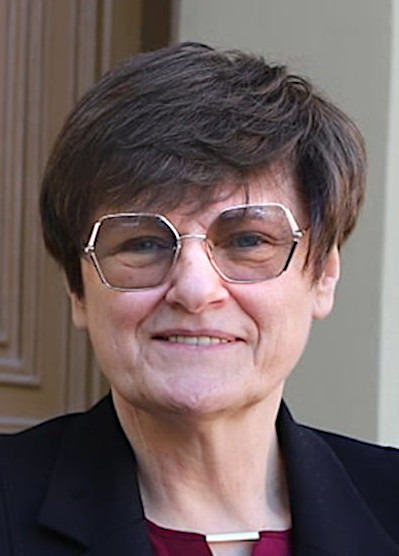{fig-alt="Portrait of Katalin Karikó"}

[Katalin Karikó]{.portrait-name}[with Drew Weissman — Nobel Prize, 2023]{.portrait-role}
:::
:::
:::
::::

::: {.cite}
@polack2020
:::

::: {.notes}
A whole slide on this because it is the same idea the deck returns to three more times.

Innate immunity does not inspect what your nucleic acid *codes for*. It pattern-matches on
chemical features that distinguish "foreign" from "self" — unmodified uridine in RNA,
unmethylated CpG in DNA, double-stranded RNA. Karikó and Weissman's insight was that you
can keep the message and change the features.

Hold that thought. When we get to CpG depletion in the AAV genome and the TLR9 response,
it is exactly the same manoeuvre on a different sensor — and the same reason it works.
:::

## Delandistrogene Moxeparvovec: A Gene Cut to Fit {.k-violet}

:::: {.columns}
::: {.column width="52%"}
Duchenne muscular dystrophy. One dose, intended to last.

- rAAVrh74 to skeletal muscle
- **Micro**-dystrophin, not dystrophin
- Full-length gene is 11 kb — it does not fit

[≈5 kb cassette]{.metric}
:::
::: {.column width="48%"}
::: {.plate}
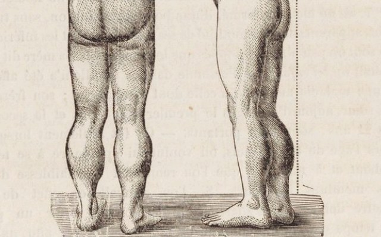{fig-alt="Nineteenth-century engraving showing calf pseudohypertrophy in a child with Duchenne muscular dystrophy."}
:::

[Calf pseudohypertrophy, from Duchenne's own 1868 plates.]{.portrait-role}

[The courier is fixed. The cargo was redesigned.]{.bang}
:::
::::

::: {.cite}
@mendell2023
:::

::: {.notes}
This is the slide that sets up the whole middle of the talk, so do not rush it.

Dystrophin is 11 kb of coding sequence. AAV packages 4.7 kb. So the therapy is not
"dystrophin gene therapy" — it is a deliberately truncated protein, missing most of the
central rod domain, designed to retain selected actin-binding and dystrophin-associated complex-binding functions
and fit in a vector. This micro-dystrophin omits the full-length C-terminal domain.

That is a physical constraint dictating a biological design. Flag it now; we come back to
it with the cassette budget.
:::

## Pembrolizumab: The Odd One Out {.k-violet}

:::: {.columns}
::: {.column width="52%"}
Not a vector at all — a protein, made by cells.

- Humanised IgG4 against PD-1
- Mouse-derived binding loops on a human frame
- Manufactured from a cell line

[≈1.4 kb of coding sequence]{.metric}
:::
::: {.column width="48%"}
::: {.portrait-row}
::: {.portrait}
{fig-alt="Portrait photograph of Jimmy Carter, taken in 2014."}

[Jimmy Carter]{.portrait-name}[Announced metastatic melanoma in August 2015; clear scans by December]{.portrait-role}
:::
:::

Melanoma in liver and brain, treated with surgery, radiosurgery and this antibody.

[The product is a protein. The asset is the sequence.]{.bang}
:::
::::

::: {.cite}
@emancipator2020; @goldberg2016
:::

::: {.notes}
Included deliberately as the odd one out. No virus, no delivery problem, no packaging
limit — and still fundamentally a sequence-engineering success.

Humanisation is the detail worth a sentence: take murine CDR loops, graft them onto a
human framework, then fix what breaks. That is exactly the "different, but not too
different" design problem that comes back on the ITR slide at the end.

Carter is here because he made the whole thing public himself, in August 2015 and again
that December — so it is a case you can tell without touching anyone's private medical
information. Metastatic melanoma with brain lesions had a median survival measured in
months. He had the liver lesion resected, stereotactic radiosurgery to four brain
lesions, and pembrolizumab; he stopped treatment in 2016 and lived to 100.

Keep the causal claim honest if asked: he had three treatments at once, so his own case
does not isolate the drug. The trial evidence does — Goldberg and colleagues reported
durable intracranial responses to pembrolizumab in melanoma brain metastases the
following year.
:::

## Four Sequences, Drawn to Scale {.k-violet .webonly}

::: {.viz-stage data-viz="seqscale" data-prevent-swipe="true" style="height:560px"}
:::

[Impact has nothing to do with length. The design problem is the same in every case.]{.bang}

::: {.notes}
Let the blocks fill before talking over them. Drawn to scale, one bead per hundred bases.

The visual argument: ChAdOx1 is twenty-five times the size of pembrolizumab's coding
sequence and neither fact predicts anything about clinical impact. What they share is
that somebody chose the sequence.

And once a therapeutic is a sequence, choosing it is a search problem over a space you
cannot enumerate. That is the whole talk.
:::

# The Virus Worth Borrowing {.act .k-teal}

AAV is a defective parasite of other viruses. That defect is exactly why we use it.

## Adeno-Associated Virus, Up Close {.k-teal .webonly}

:::: {.columns}
::: {.column width="40%"}
- 4.7 kb single-stranded DNA
- 60 subunits, **T = 1**
- ≈26 nm across
- No established human disease from natural AAV infection

[Drag it.]{.bang}
:::
::: {.column width="60%"}
::: {.viz-stage data-viz="capsid" data-pdb="assets/pdb/1lp3.cif" data-assembly="BU1" data-rep="spacefill" data-caption="AAV2, PDB 1LP3 — 60 subunits from icosahedral symmetry" data-prevent-swipe="true" style="height:620px"}
:::
:::
::::

::: {.cite}
@xie2002
:::

::: {.notes}
Live render of the deposited AAV2 structure — one asymmetric unit, sixty symmetry
operators applied in the browser. Colour runs from capsid interior to exterior, which is
the convention in the structural literature.

Turn it to a 3-fold axis: those spikes are the receptor-binding surface. Then a 5-fold:
that channel is how the genome gets in and out.

Everything engineered in the back half of this talk happens on the outside of this
object.
:::

## Where the Symmetry Is {.k-teal .webonly}

:::: {.columns}
::: {.column width="32%" .tight}
Sixty identical subunits, related by the rotation group of an icosahedron.

- [**5-fold** ×6 — a channel at each]{style="color:#f472b6"}
- [**3-fold** ×10 — the protrusions]{style="color:#fbbf24"}
- [**2-fold** ×15 — a depression at each]{style="color:#38bdf8"}

Every axis passes through the centre. Each order is a different local
environment, and they behave differently.
:::
::: {.column width="68%"}
::: {.viz-stage data-viz="capsid" data-pdb="assets/pdb/1lp3.cif" data-assembly="BU1" data-rep="spacefill" data-opacity="0.45" data-axes="5,3,2" data-spin="0.1" data-caption="Axes computed from the 60 symmetry operators, not assumed" data-prevent-swipe="true" style="height:600px"}
:::
:::
::::

::: {.cite}
@xie2002
:::

::: {.notes}
The axes here are not drawn by hand. The runtime reads the sixty symmetry operators out
of the deposited assembly, takes the rotation angle of each one — 72° and 144° mean a
5-fold, 120° a 3-fold, 180° a 2-fold — and recovers the axis direction from the matrix.
Six, ten and fifteen lines, exactly as the icosahedral group requires.

Why a virologist should care about each:

- **5-fold** — a pore runs down it. The VP1 N-terminus is externalised through it, and
  the genome is threaded in through it during packaging.
- **3-fold** — the protrusions. Receptor binding, and most neutralising antibody epitopes.
  This is where almost all engineering happens.
- **2-fold** — a depression. Shallow, and generally less tolerant of insertion.

The shell is at 45% opacity so you can see the axes pass right through. Drag it: line up a
5-fold and you are looking straight down the pore.
:::

## Everything in 4.7 Kilobases {.k-teal}

::: {.diagram}
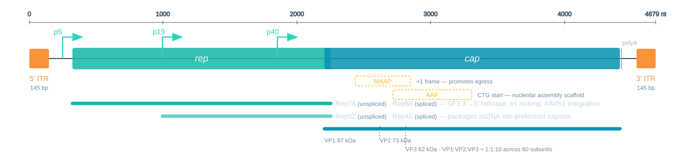{fig-alt="Scale map of the wild-type AAV2 genome showing the two ITRs, the p5, p19 and p40 promoters, the rep and cap open reading frames, and the nested AAP and MAAP accessory reading frames."}
:::

Two genes. Three promoters. Two more proteins hidden inside *cap*.

::: {.cite}
@samulski2014
:::

::: {.notes}
Orientation slide — do not read it out. Point at four things and move on: the ITRs at
each end, *rep*, *cap*, and the three promoters named for where they sit in map units.

The next three slides take each piece in turn.
:::

## Four Rep Proteins We Throw Away {.k-teal}

:::: {.columns}
::: {.column width="50%"}
**From p5** — Rep78, Rep68

Nick the terminal resolution site. Drive integration at **AAVS1** on chromosome 19.

**From p19** — Rep52, Rep40

Motor proteins. Thread the genome into a preformed capsid.
:::
::: {.column width="50%"}
Each pair is one unspliced and one spliced product. All four are SF3 helicases, 3′→5′.

[Delete *rep* and you delete site-specific integration.]{.bang}
:::
::::

::: {.cite}
@kotin1990
:::

::: {.notes}
The splicing detail is worth stating precisely because it is commonly garbled: p5 gives
Rep78 unspliced and Rep68 spliced; p19 gives Rep52 and Rep40 the same way.

The line that matters for later: wild-type AAV has a mechanism for permanent residence,
and recombinant vectors throw it away. That trade — insertional mutagenesis risk against
episomal dilution — is why expression fades in dividing tissue.
:::

## Three Capsid Proteins, Unequal Shares {.k-teal}

:::: {.columns}
::: {.column width="50%"}
One ORF, three start sites.

| | | |
|---|---|---|
| **VP1** | 87 kDa | PLA₂ + NLS |
| **VP2** | 73 kDa | dispensable |
| **VP3** | 62 kDa | the shell |

:::
::: {.column width="50%"}
Roughly **1 : 1 : 10** across the 60 subunits — about five, five and fifty.

VP1 is a minority subunit, and endosomal escape depends entirely on it.

[Five copies out of sixty decide whether the particle ever gets out of the endosome.]{.bang}
:::
::::

::: {.cite}
@girod2002
:::

::: {.notes}
The ratio is ≈1:1:10, not 1:1:5 — you will see 1:1:5 misquoted, and it contradicts VP3
being about 85% of the capsid. It also drifts with serotype and with prep, which is why
it is a release-critical attribute.

The VP1 point is the one to land. Its unique N-terminal region carries a phospholipase A2
domain that is buried in the intact particle and externalised under endosomal
acidification. That is what breaches the membrane — and there are only about five copies
per capsid.
:::

## Two Genes in the Same Sequence {.k-teal}

:::: {.columns}
::: {.column width="50%"}
**AAP** — assembly-activating protein

Non-canonical CTG start, nested inside *cap*. Scaffolds assembly in the nucleolus.

**MAAP** — membrane-associated accessory protein

A **+1** frame inside the VP3 region. Promotes egress.
:::
::: {.column width="50%"}
MAAP was not found by looking. It fell out of a comprehensive mutational scan in 2019.

[A previously unannotated gene emerged from systematic mutational data.]{.bang}
:::
::::

::: {.cite}
@sonntag2010; @ogden2019
:::

::: {.notes}
This slide is a deliberate plant for the ML section, and in a virology room it lands
harder than any engineering result.

Ogden and colleagues did a comprehensive single-mutant scan of the AAV2 capsid and
measured fitness by sequencing. The mutational data did not behave the way a
single-reading-frame model predicted — and out of that fell a previously unannotated
viral gene, in the +1 frame, thirty years after the genome was first sequenced.

The mutational scan revealed biology that targeted experiments had missed. Hold that
thought until *What Deep Mutational Scanning Measures*.
:::

## Defective by Design {.k-teal}

:::: {.columns}
::: {.column width="50%"}
AAV cannot replicate alone. It needs a helper.

**Adenovirus** — E1A, E1B55K, E2A, E4orf6, VA RNA

**HSV-1** — UL5, UL8, UL52, UL29, UL30
:::
::: {.column width="50%"}
For a vector this is a feature:

- Helper functions supplied from a plasmid
- No helper virus needed in plasmid-based production
- A vector that cannot replicate cannot spread

[Replication incompetence is not a limitation. It is the product.]{.bang}
:::
::::

::: {.cite}
@samulski2014
:::

::: {.notes}
The pivot of the section. Natural AAV's dependence on a co-infecting helper looks like
weakness; for a vector it is the most useful property it has, and it is most of the
safety argument.

Note the name: *Dependoparvovirus*. The genus is named for the defect.
:::

## Why Not Adenovirus? {.k-teal}

:::: {.columns}
::: {.column width="50%"}
**Good vaccine**

- ≈8 kb payload
- Efficient, high expression
- Strong immune response
:::
::: {.column width="50%"}
**Poor gene therapy**

- That same response clears transduced cells
- High seroprevalence
- Inflammatory at therapeutic doses
:::
::::

A vaccine wants an immune response. A gene therapy does not.

::: {.cite}
@dunbar2018
:::

::: {.notes}
One sentence explains the entire divergence in vector choice, and it is the one on the
slide.

The honest caveat, because this room will think it: AAV's low immunogenicity is relative
and dose-dependent. At the systemic doses used for muscle and liver it is emphatically
not silent. We spend a whole act on that.
:::

## Serotypes Are Surface Chemistry {.k-teal .webonly}

:::: {.columns}
::: {.column width="32%" .tight}
Same fold. Same **T = 1** shell. Nine variable loops on the outside.

- **AAV2** → heparan sulfate
- **AAV9** → terminal galactose
- **VR-IV** differs: AAV9's spikes are blunter

[Tropism lives on these loops.]{.bang}
:::
::: {.column width="34%"}
::: {.viz-stage data-viz="capsid" data-pdb="assets/pdb/1lp3.cif" data-assembly="BU1" data-rep="spacefill" data-caption="AAV2 — PDB 1LP3" data-prevent-swipe="true" style="height:560px"}
:::
:::
::: {.column width="34%"}
::: {.viz-stage data-viz="capsid" data-pdb="assets/pdb/3ux1.cif" data-assembly="BU1" data-rep="spacefill" data-caption="AAV9 — PDB 3UX1" data-prevent-swipe="true" style="height:560px"}
:::
:::
::::

::: {.cite}
@xie2002; @dimattia2012; @summerford1998; @shen2011
:::

::: {.notes}
Both rendered identically and at the same scale, so the comparison is fair.

There is no "AAV2 protein" and "AAV9 protein" in any deep sense. Same β-barrel fold,
different surface loops — and those loops decide which glycan it binds, which tissue it
reaches, and which antibodies recognise it.

That is why capsid engineering is tractable at all. You are not redesigning a fold, you
are editing loops on a scaffold that tolerates it.
:::

# From Virus to Vector {.act .k-cyan}

Delete everything that makes it a virus. Keep 145 base pairs at each end.

## Strip It Down to the ITRs {.k-cyan}

::: {.diagram}
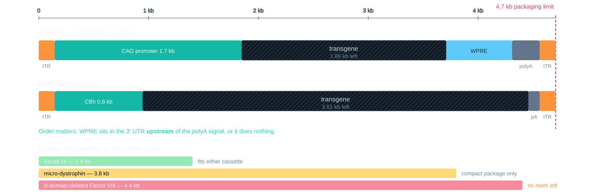{fig-alt="Two recombinant AAV expression cassettes drawn to scale against the 4.7 kb packaging limit, with Factor IX, micro-dystrophin and B-domain-deleted Factor VIII coding sequences drawn to the same scale."}
:::

::: {.cite}
@gray2011; @zantaboussif2009
:::

::: {.notes}
Everything competes for the same 4.7 kb, and the regulatory elements are not free — CAG
alone eats more than a third of the budget.

Two things this audience will appreciate. Element order is not cosmetic: WPRE has to sit
in the 3′ UTR upstream of the polyA signal or it is simply not transcribed. And WPRE is
not free either — it carries a truncated Woodchuck hepatitis X ORF, which is why the
field moved to WPRE3 and mut6 variants.
:::

## The Budget Decides the Medicine {.k-cyan}

:::: {.columns}
::: {.column width="50%"}
| Payload | Size | Fits? |
|---|---|---|
| Factor IX | 1.4 kb | easily |
| micro-dystrophin | 3.8 kb | compact cassette only |
| BDD Factor VIII | 4.4 kb | nothing left over |
| **dystrophin** | **11 kb** | **never** |
:::
::: {.column width="50%"}
This is why Duchenne therapy is micro-dystrophin, and why haemophilia A is harder than
haemophilia B.

[A physical limit on a capsid is dictating protein design.]{.bang}
:::
::::

::: {.cite}
@mendell2023
:::

::: {.notes}
Call back to *Delandistrogene Moxeparvovec* explicitly. The packaging limit is not an inconvenience, it is the
reason an entire therapeutic class looks the way it does.

Factor IX is small and comfortable, which is why haemophilia B got there first.
B-domain-deleted Factor VIII at 4.4 kb leaves essentially no room for a promoter, and
that is why that programme has been so much harder.
:::

## What the Budget Produced {.k-cyan .smaller}

:::: {.columns}
::: {.column width="62%"}
| Product | Vector | Payload | Route |
|---|---|---|---|
| Zolgensma (2019) | AAV9 | *SMN1* 0.9 kb | intravenous |
| Itvisma (2025) | AAV9 | *SMN1* 0.9 kb | intrathecal |
| Hemgenix (2022) | AAV5 | *F9* Padua 1.4 kb | intravenous |
| Kebilidi (2024) | AAV2 | *DDC* 1.4 kb | intraputaminal |
| Fayuvi (2026) | AAV9 | *SGSH* 1.5 kb | intravenous |
| Luxturna (2017) | AAV2 | *RPE65* 1.6 kb | subretinal |
| Elevidys (2023) | AAVrh74 | micro-dystrophin 3.8 kb | intravenous |
| Otarmeni (2026) | **AAV1 × 2** | *OTOF* 6.0 kb | intracochlear |
:::
::: {.column width="38%"}
Ordered by payload. Every one but the last sits well inside the 4.7 kb budget.

*OTOF* is **6 kb**. It does not fit — so otoferlin ships as **two vectors**, each
carrying part of the coding sequence, reconstituted inside the hair cell.

[The budget did not move. The architecture did.]{.bang}
:::
::::

::: {.cite}
@fda2026products; @fda2026otarmeni
:::

::: {.notes}
The list is short, and that is the point. Read down the payload column against the table
you just showed: every approved product but one is a small gene, exactly as the budget
predicts. Nobody has approved an 11 kb transgene, because nobody can.

*Otarmeni* is the slide's payoff and it is only months old — approved April 2026 for
*OTOF*-related deafness. Otoferlin is 1,997 residues, about 6 kb of coding sequence, so
it cannot be packaged. The product is two AAV1 vectors carrying overlapping halves, and
the full-length coding sequence is reconstituted in the transduced hair cell. That is the
packaging limit being designed around rather than obeyed — and it costs you a second
vector, a second dose of capsid antigen, and a dependence on both halves reaching the
same cell.

Now read the route column, because it is the quieter lesson and it sets up the dose
ceiling. Subretinal, intraputaminal and intracochlear are small, enclosed,
immune-privileged compartments: the dose is tiny and it stays where you put it. The
intravenous products are the ones carrying the safety burden. Elevidys has carried a
boxed warning since November 2025 for serious liver injury and acute liver failure, after
two deaths in non-ambulatory patients, and its indication is now restricted to ambulatory
patients aged four and over.

Zolgensma and Itvisma are worth a sentence: same vector, same transgene, different route.
Intrathecal delivery was approved in November 2025 precisely so that older, heavier
patients could be dosed without the systemic load an intravenous dose would require. When
you cannot lower the dose, you change where it goes.

If asked what is missing: three AAV products have left the market. Glybera, the first
gene therapy approved in the West, was withdrawn in 2017. Beqvez was discontinued by
Pfizer in February 2025, having treated no commercial patients. Roctavian — the BDD
Factor VIII product from the previous slide — was voluntarily withdrawn in February 2026
after BioMarin could not find a buyer. None of those three failed because the biology
failed. Approval is not the finish line, and this is a field where working and selling
are different problems.
:::

## ssAAV or scAAV: Capacity Against Onset {.k-cyan}

::: {.diagram}
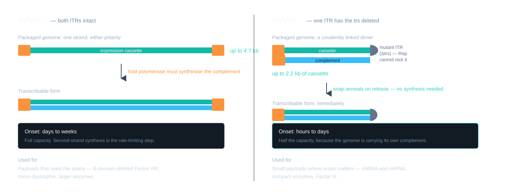{fig-alt="Single-stranded AAV compared with self-complementary AAV, showing that deleting the terminal resolution site from one ITR causes a covalently linked dimer to be packaged, trading half the capacity for immediate expression."}
:::

::: {.cite}
@mccarty2001
:::

::: {.notes}
The mechanism is one sentence. Rep resolves each ITR by nicking the terminal resolution
site. Delete the trs from one ITR, Rep cannot resolve it, and the replication intermediate
is packaged as a covalently linked dimer — a genome carrying its own complement.

It snap-anneals on release, skipping second-strand synthesis entirely. Weeks become days.
The cost is exactly half the capacity.

Straight trade: capacity against onset.
:::

# Getting In {.act .k-amber}

Eight steps between the syringe and a transcribing genome. Most of the dose does not
survive them.

## From the Needle to the Cell {.k-amber}

::: {.diagram}
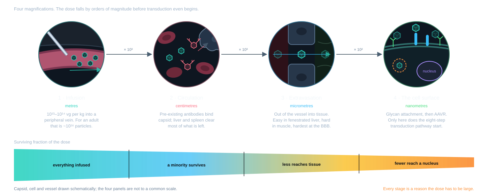{fig-alt="The journey of an AAV dose from the infusion needle to the target cell in four magnifications — infusion into a vein, circulation where antibodies and liver and spleen clearance remove most of the dose, extravasation across the vessel wall, and arrival at the cell surface — with a tapering band showing the surviving fraction collapsing at every stage."}
:::

::: {.cite}
@mingozzi2013
:::

::: {.notes}
Everything on the next slide happens *inside* a cell. This one is about getting there,
and it is where most of the dose is already gone.

Three things to say over it. Pre-existing neutralising antibodies are the big one — a
large fraction of adults are seropositive for common serotypes, which is why trials
screen for it and why you cannot redose. Liver and spleen take vector regardless of
where you wanted it to go. And the endothelium is a real barrier: fenestrated in liver,
continuous in muscle, tight junctions at the brain.

The honest framing for the band at the bottom: it is qualitative. The exact fractions
depend on serotype, route, species and assay, and anyone who quotes you a single number
for "percentage reaching target" is selling something.

So the dose has to be enormous. Hold that thought for the toxicity slides.
:::

## The Journey In, Step by Step {#aav-cell-journey .k-amber .webonly}

::: {.viz-stage data-viz="celljourney" data-still="assets/diagrams/transduction.svg" data-alt="AAV attaches, enters by endocytosis, escapes vesicular degradation, reaches the nucleus, uncoats, forms duplex DNA and circular episomes, and is transcribed by RNA polymerase II; the mRNA is exported through a nuclear pore and translated by ribosomes into protein." data-prevent-swipe="true" style="height:650px"}
:::

::: {.cite}
@girod2002; @cataldi2010; @nakai2001
:::

::: {.notes}
Once playing, the journey loops; with reduced motion it starts paused, so press Play.
Select any numbered stage to pause there.
The coloured particles represent four independently delivered vector genomes.
The red branch shows loss to degradation, not a measured survival fraction.

The entry route is simplified. Endosomal and Golgi trafficking precede nuclear
entry, and the site of membrane escape and the precise mechanism of nuclear
uncoating remain incompletely resolved. Capsid opening is a teaching schematic.

The two-genome and four-genome views illustrate possible circular concatemers.
They do not mean that the vector replicates, or that every dimer becomes a tetramer.
Monomers, linear forms and other concatemer arrangements also occur. Host DNA repair
contributes to joining, with pathway use depending on cell type and context.

Transcription requires an accessible duplex template, not completion of a fixed
circularization sequence. One polymerase and one transcript stand in for many:
the mRNA leaves the nucleus 5′ end first, and in the cytoplasm several ribosomes
read it at once, each releasing a chain that folds into protein. Persistent
episomes become chromatinized, omitted here for clarity.

Primary evidence for nuclear entry before uncoating:
https://pubmed.ncbi.nlm.nih.gov/10684294/
Genome repair and concatemer formation:
https://pmc.ncbi.nlm.nih.gov/articles/PMC2918998/
:::

## Two Bottlenecks Inside the Cell {.k-amber}

:::: {.columns}
::: {.column width="50%"}
**Endosomal escape**

Needs VP1u's PLA₂ domain, externalised at low pH.

Five copies per capsid.
:::
::: {.column width="50%"}
**Second-strand synthesis**

The packaged strand is transcriptionally inert until it is made double-stranded.

scAAV exists to skip this.
:::
::::

[Potency also depends on targeting, nuclear entry, uncoating and expression.]{.bang}

::: {.cite}
@girod2002; @mccarty2001
:::

::: {.notes}
Pulled out of the pipeline because these are the two places the money goes.

These are two useful examples, not a universal ranking. Which step limits transduction
depends on the capsid and target cell. Improving productive delivery can reduce the dose — which is the argument the whole back half of the talk rests on.
:::

## What the Genome Becomes {.k-amber .webonly}

:::: {.columns}
::: {.column width="34%" .tight}
- Second strand synthesised
- Host repair joins vector DNA ends
- Circular monomers and concatemers
- Chromatinised with host nucleosomes

The damage response is **not** evaded. MRN and ATM/ATR sense those hairpin ends.
:::
::: {.column width="66%"}
::: {.viz-stage data-viz="episome" data-prevent-swipe="true" style="height:580px"}
:::
:::
::::

::: {.cite}
@nakai2001
:::

::: {.notes}
Four looping phases: delivered single strand, second-strand synthesis, circularisation,
chromatinised episome.

Two things the literature gets sloppy about in talks. NHEJ can contribute strongly to circularization, but pathway use depends on cell type.
Homologous recombination can also contribute to genome joining. And concatemers
are not invisible to the damage machinery; the MRN complex senses those hairpin ends.
"Chromatinised and tolerated" is accurate. "Undetected" is not.
:::

## From Hairpin to Chromatin {.k-amber}

::: {.diagram}
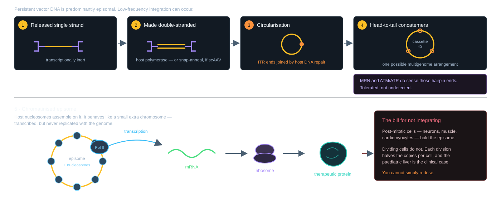{fig-alt="The fate of the delivered AAV genome: the released single strand with its T-shaped ITR hairpins is made double-stranded, host repair can join ITR ends into circular monomers and concatemers, and the circle is wrapped in host nucleosomes into a chromatinised episome that RNA polymerase II transcribes into mRNA and the ribosome translates into the therapeutic protein."}
:::

::: {.cite}
@nakai2001
:::

::: {.notes}
The printable version of the animation before it, and the slide to use if the room wants
the mechanism written down.

The sequence to narrate: the strand arrives inert, gets a second strand, the two ITR
ends undergo repair-mediated joining. Circular monomers and concatemers can form.
NHEJ and homologous repair contributions vary by context. Most persistent vector DNA
is episomal, although low-frequency integration can occur. Then host nucleosomes
assemble on it and it is transcribed like any other chromatin.

The payoff is the right-hand box. Transcribed but never replicated is the whole clinical
story: wonderful in a neuron or a cardiomyocyte, a dilution problem in a liver that is
still growing. And because the first dose raises antibodies, you do not get a second go.
:::

## Why Expression Fades {.k-amber}

:::: {.columns}
::: {.column width="50%"}
The episome is **not replicated** when the cell divides.

**Post-mitotic** — neurons, cardiomyocytes, muscle. Episomes can support durable
expression, depending on the tissue and vector.

**Dividing** — paediatric liver is the clinical case. Hepatocytes expand out from under
the vector.
:::
::: {.column width="50%"}
This is the bill for deleting *rep*.

Wild-type AAV integrated at AAVS1. Recombinant vectors gave that up for safety, and took
dilution in exchange.

[Decades of expression is the hypothesis under test, not a result.]{.bang}
:::
::::

::: {.cite}
@nakai2001
:::

::: {.notes}
Avoid promising lifelong expression. Duration varies by product, tissue and patient,
and long-term follow-up is essential.

The paediatric liver problem deserves a beat because it is where the biology bites a real
programme: you cannot simply redose, because the antibody response to the first dose
blocks the second.

That closes the biology arc. If you only get one shot, the dose has to be right — and the
dose has to be manufactured.
:::

# Making It at Scale {.act .k-green}

A dose is 10¹³–10¹⁴ genomes per kilogram. For an adult that is a bioprocess, not a bench
prep.

## Two Platforms, Three Components {.k-green}

::: {.diagram}
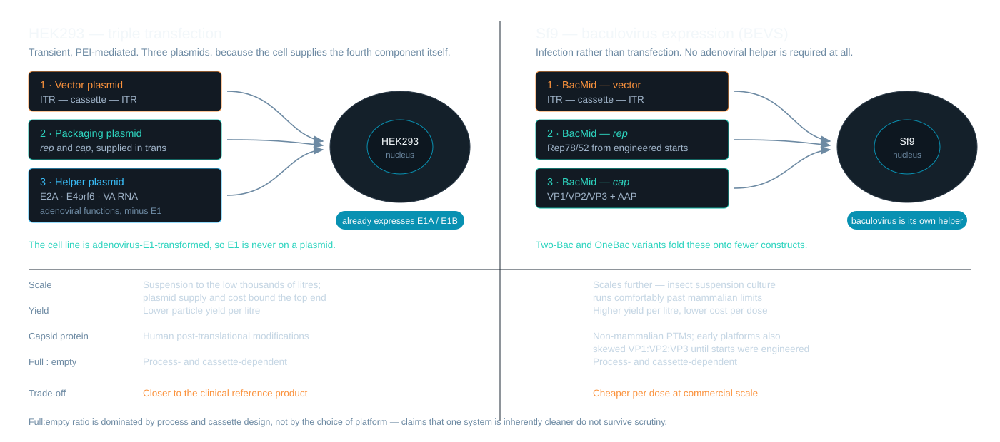{fig-alt="HEK293 triple transfection compared with the Sf9 baculovirus expression system, showing the genetic components each platform delivers and a comparison of scale, yield and capsid protein modification."}
:::

::: {.cite}
@urabe2002
:::

::: {.notes}
Three components have to reach the cell: the ITR-flanked cassette, rep and cap, and
helper functions. Mammalian systems transfect them; insect systems infect with
baculovirus and need no adenoviral helper at all.

Be careful with the full:empty claim. You will hear that mammalian systems give cleaner
preparations. It does not survive scrutiny — full:empty is dominated by process and
cassette design, not by host.
:::

## HEK293 Already Has E1 {.k-green}

:::: {.columns}
::: {.column width="52%"}
The helper plasmid carries **E2A, E4orf6 and VA RNA**.

It does not carry E1.

HEK293 is adenovirus-E1-transformed — that is what makes it HEK293.
:::
::: {.column width="48%"}
E1 functions come from the producer cell. The helper plasmid supplies the remaining
adenoviral functions used in this platform.

[Helper functions come from both the cell and the plasmid.]{.bang}
:::
::::

::: {.cite}
@urabe2002
:::

::: {.notes}
A whole slide for one fact, because it is the detail that separates someone who has read
the protocol from someone who has run it — and because the error is extremely common in
review figures.

Adenovirus E1 transformed the original HEK cells in 1977. The line carries it
constitutively. So the triple transfection supplies E2A, E4orf6 and VA RNA, and nothing
else of adenoviral origin.

On the insect side, the pleasant surprise: baculovirus infection provides a permissive
environment by itself, so no adenoviral helper is required at all.
:::

## Downstream: Capture, Polish, Concentrate {.k-green}

::: {.diagram}
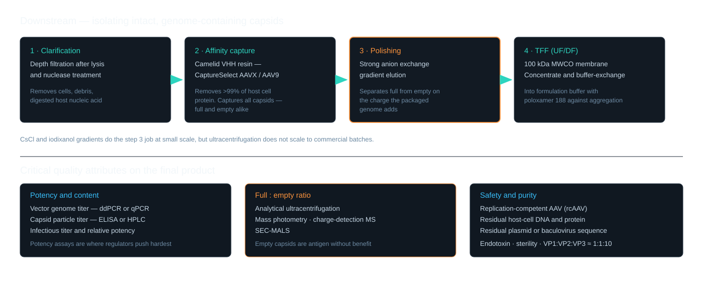{fig-alt="The rAAV downstream purification train — clarification, camelid VHH affinity capture, anion exchange polishing to separate full from empty capsids, and tangential flow filtration — followed by the critical quality attributes."}
:::

::: {.cite}
@mingozzi2013
:::

::: {.notes}
The affinity step captures every intact capsid, full and empty alike, because the ligand
binds the surface and knows nothing about the contents.

So separating full from empty is a separate polishing step, working on the small charge
difference the packaged genome contributes. CsCl and iodixanol do the same job at bench
scale and do not scale to commercial batches.
:::

## Empty Capsids Are Not Free {.k-green}

:::: {.columns}
::: {.column width="52%"}
An empty capsid delivers nothing and still:

- presents capsid antigen
- consumes immune tolerance
- counts toward total particle dose
:::
::: {.column width="48%"}
Which is why full:empty ratio is a **release-critical** attribute and not a cosmetic one.

Measured by AUC, mass photometry, charge-detection MS.

[Antigen without benefit.]{.bang}
:::
::::

::: {.cite}
@mingozzi2013
:::

::: {.notes}
This is the bridge into the immunology act, so make it explicitly.

The patient's immune system responds to capsid protein. It cannot tell a full particle
from an empty one. So every empty capsid in the vial spends part of a budget that is
strictly limited, and buys nothing with it.

That means a manufacturing attribute is directly setting a clinical ceiling.
:::

# The Dose Ceiling {.act .k-coral}

Efficacy rises with dose. So does toxicity. The gap between them is the whole problem.

## The Therapeutic Window {.k-coral}

::: {.diagram}
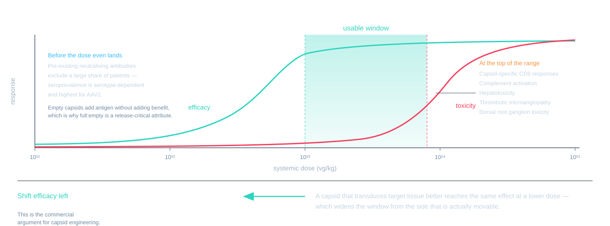{fig-alt="The systemic rAAV therapeutic window, with efficacy and toxicity curves against dose, neutralising antibodies excluding patients at the low end, and capsid T cell responses, complement activation, hepatotoxicity, thrombotic microangiopathy and dorsal root ganglion toxicity bounding the high end."}
:::

::: {.cite}
@manno2006; @hinderer2018
:::

::: {.notes}
The hinge of the talk. Everything before is setup; everything after is a response to this
slide.

Say the argument out loud: you cannot move the toxicity curve much, because it is driven
by total capsid dose. You *can* move the efficacy curve, by building a capsid that does
more per particle. That is why capsid engineering is a commercial priority and not an
academic one.
:::

## Three Ways the Dose Fails {.k-coral}

:::: {.columns}
::: {.column width="33%"}
**Before**

Pre-existing neutralising antibodies exclude a large share of patients. Worst for AAV2.
:::
::: {.column width="33%"}
**At dose**

Capsid-specific CD8 T cells clear transduced hepatocytes — expression rises, then falls.
:::
::: {.column width="34%"}
**Above dose**

Complement, hepatotoxicity, thrombotic microangiopathy, dorsal root ganglion toxicity.
:::
::::

Unmethylated **CpG** can activate TLR9 and promote adaptive responses.
These toxicities have multiple mechanisms.

::: {.cite}
@mingozzi2013; @faust2013; @hinderer2018
:::

::: {.notes}
Manno 2006 is the foundational observation for the middle column: in the first haemophilia
B trial, Factor IX expression rose and then fell, tracking a T cell response to capsid —
not to the transgene. The vector worked; the immune system removed the cells that had
taken it up.

The right-hand column is why high-dose systemic programmes have had serious adverse
events, and it is what sets the practical ceiling today.

The CpG line is the thread into the ITR engineering slide at the end.
:::

# Engineering the Modules {.act .k-magenta}

Three parts of the cassette can be designed: the capsid, the promoter, the ITRs. Each is
a different kind of search.

## Three Modules, Three Searches {.k-magenta}

:::: {.columns}
::: {.column width="33%"}
**Capsid**

Where it goes, and whether antibodies see it.

*A protein-surface problem.*
:::
::: {.column width="33%"}
**Promoter**

Which cells express, and how much.

*A regulatory-grammar problem.*
:::
::: {.column width="34%"}
**ITR**

Packaging, persistence, and innate sensing.

*A structure-constrained problem.*
:::
::::

::: {.notes}
Set the map before walking it. These are genuinely different problems and they need
different methods — which is the reason the back of this talk is not just "apply a
transformer".

The capsid has the most data and the most commercial pull, so it gets the most slides.
:::

## The Search Space Is the Problem {.k-magenta .webonly}

:::: {.columns}
::: {.column width="40%" .tight}
VP1 is **735 residues**.

A 60-residue window is 20⁶⁰ ≈ 1.15 × 10⁷⁸ — about the atom count of the observable
universe. It takes **62** to exceed it.

But nobody designs the whole capsid.
:::
::: {.column width="60%"}
::: {.viz-stage data-viz="seqspace" data-prevent-swipe="true" style="height:560px"}
:::
:::
::::

[A 7-mer insertion at VR-VIII is 20⁷ ≈ 1.3 × 10⁹ — and that already outruns any in vivo screen.]{.bang}

::: {.cite}
@arnold2009
:::

::: {.notes}
State this carefully, because the usual version of the slide is wrong. 20⁶⁰ is about
1.15 × 10⁷⁸, which is *smaller* than 10⁸⁰. You need 62 residues to pass the atom count.
Getting it right is more impressive than overstating it, and this room will check.

The real argument is the bang line. The space we actually search is tiny by comparison —
seven residues — and it is still a billion variants against a screen that handles maybe
10⁶ to 10⁸ in a pooled selection, with a noisy readout.

Nine orange peaks are the serotypes we know. Everything else is unmeasured.
:::

## Capsid Shuffling {.k-magenta .webonly}

::: {.viz-stage data-viz="shuffle" data-prevent-swipe="true" style="height:520px"}
:::

Fragment the *cap* genes of several serotypes, reassemble, select. Every chimera is a
mosaic of whichever parents crossed over.

::: {.cite}
@grimm2008
:::

::: {.notes}
DNA shuffling, applied to capsids. Digest the cap genes from a handful of natural
serotypes, let them reassemble on each other as templates, and you get chimeras carrying
blocks from several parents at once.

Then put the library through selection in the tissue you care about and sequence the
survivors.

The strength is that it explores combinations no single point-mutation scan would reach.
The weakness is on the next slide but one.
:::

## What Shuffling Produced {.k-magenta}

::: {.diagram}
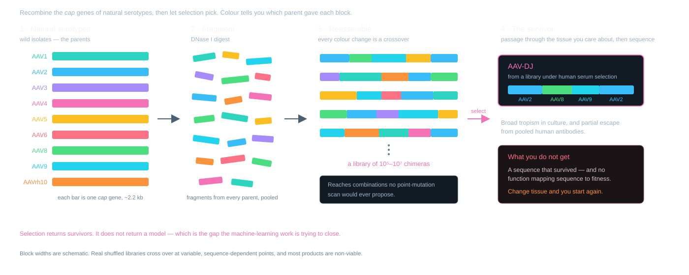{fig-alt="Capsid shuffling in four stages: the cap genes of nine natural serotypes are digested into fragments, the fragments prime on one another and reassemble into a library of chimeras whose coloured blocks show which parent contributed each stretch, and selection returns a single survivor, AAV-DJ, a mosaic of AAV2, AAV8 and AAV9. A panel notes that what you do not get is any function mapping sequence to fitness."}
:::

::: {.cite}
@grimm2008
:::

::: {.notes}
Give shuffling its due. It produced genuinely useful reagents, AAV-DJ among them, and
dismissing it would be wrong.

But note what you get at the end: a sequence that survived, and no function that maps
sequence to fitness. Run the screen again in a different tissue and you start from
scratch.

That is the gap the machine-learning work is trying to close.
:::

## Peptide Display: One Loop, a Billion Variants {.k-magenta}

::: {.diagram}
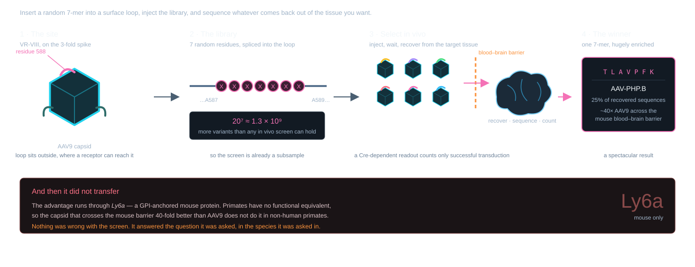{fig-alt="Peptide display in four stages: a random 7-mer is inserted into the VR-VIII loop at residue 588 of AAV9, giving 20⁷ ≈ 1.3 billion variants; the library is injected and recovered from the target tissue; the enriched sequence TLAVPFK defines AAV-PHP.B, which crosses the mouse blood-brain barrier about 40-fold better than AAV9. A band underneath notes the advantage runs through Ly6a, a mouse protein with no functional primate equivalent."}
:::

[The screen was right. The model organism was the problem.]{.bang}

::: {.cite}
@deverman2016
:::

::: {.notes}
This is the single best cautionary tale in the field and it belongs in a virology talk.

AAV-PHP.B was found by selecting for variants that transduced neurons in mice, recovered
through a Cre-dependent scheme. It works beautifully — in C57BL/6. It does not transfer
to non-human primates, because the mechanism runs through LY6A, a GPI-anchored mouse
protein with no functional primate equivalent.

So directed evolution gave a phenotype in one context and no understanding that
generalises. Which raises the obvious question: can you learn something that does?
:::

## From Mouse to Macaque {.k-magenta}

:::: {.columns}
::: {.column width="52%"}
**Fit4Function** — train one model per measurable property, on a library that uniformly
samples manufacturable sequence space.

Six models combined to design a liver-targeted, manufacturable library. **88%** of
variants met all six criteria.
:::
::: {.column width="48%"}
Trained on **mouse in vivo** and **human in vitro** data.

Predicted biodistribution in **macaque**.

[Learn properties that transfer, not winners that do not.]{.bang}
:::
::::

::: {.cite}
@eid2024
:::

::: {.notes}
This is the direct answer to the AAV-PHP.B problem, and the reason it works is the
library design rather than the model architecture.

Instead of screening for one phenotype and keeping the winner, they screened a library
that uniformly samples sequence space for many separate, individually measurable
functions — production, biodistribution, cell binding — and fitted a model to each. Then
they combined the models to specify a capsid satisfying all of them at once.

The cross-species result is the headline: models trained only on mouse in vivo and human
in vitro data predicted what happened in macaque.
:::

## Predicting Fitness Before You Measure It {.k-magenta}

:::: {.columns}
::: {.column width="52%"}
**Mikos, Chen & Suh** (Rice) asked a narrower question: can you predict *production*
fitness from **structure alone**?

Random-forest style models on structural features — without prior AAV fitness measurements as training labels.
:::
::: {.column width="48%"}
Reported **threefold** enrichment in mutations beating wild-type production,
compared with random mutagenesis (preprint).

Production fitness is unglamorous and gates everything — a capsid you cannot manufacture
is not a capsid.
:::
::::

::: {.cite}
@mikos2021
:::

::: {.notes}
Worth including because it attacks a different and underrated axis. Everyone optimises
tropism; far fewer optimise whether the thing can be made at scale, and a variant that
packages badly is worthless however well it targets.

The interesting methodological claim is that structural features alone carry enough
signal to triple your hit rate, without any measured fitness data to train on. That
matters when you are engineering a serotype nobody has screened.

If asked: this was a preprint from the Suh lab at Rice. Check for the published version
before citing it as settled.
:::

## Discriminative or Generative {.k-magenta}

::: {.diagram}
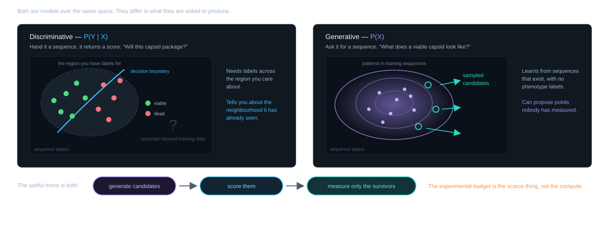{fig-alt="Discriminative versus generative models over sequence space. A discriminative model learns P(Y|X): it draws a boundary through the small labelled region and has uncertain predictions outside its training distribution. A generative model learns P(X), a distribution over training sequences, from sequences without phenotype labels, and new candidates can be sampled from it. A pipeline underneath shows the combination: generate candidates, score them, measure only the survivors."}
:::

::: {.cite}
@ng2001
:::

::: {.notes}
Do not let this become a generic ML slide. The reason the distinction matters here is the
specific shape of the data: a vast space, a tiny labelled fraction, and a strong prior
available from evolution in the form of sequences that exist and work.

A discriminative model can only tell you about the neighbourhood you have labels for. A
generative model learns the shape of the viable region itself.
:::

## What a VAE Actually Does {.k-magenta .webonly}

:::: {.columns}
::: {.column width="36%" .tight}
**Encoder** squeezes a sequence into a few numbers.

**Decoder** rebuilds a sequence from them.

Training forces the middle to be a smooth, well-populated cloud — so you can **sample**
it, and **interpolate** across it.
:::
::: {.column width="64%"}
::: {.viz-stage data-viz="latent" data-prevent-swipe="true" style="height:560px"}
:::
:::
::::

::: {.cite}
@ng2001; @bryant2021
:::

::: {.notes}
Explain it in one breath: a VAE is an autoencoder with a penalty that forces the latent
distribution towards a simple prior. Without that penalty you get a lookup table with
holes in it. With it, the space between training points is meaningful.

That is the whole value here. Sequence space is discrete and astronomically large. A
latent space is continuous and small, and sampled points can decode to plausible candidates — so you can wander it, interpolate between two capsids, or sample a thousand
candidates that all look like things evolution could have made.

The strip underneath is the decoded sequence. Watch it change smoothly as the sampler
moves. That smoothness is the property you are paying for.
:::

## The Generative Toolkit {.k-magenta}

:::: {.columns}
::: {.column width="50%"}
**VAE** — smooth latent space, easy to sample and interpolate

**GAN** — sharp samples, harder to train, no likelihood

**Diffusion** — strong sample quality, slower to generate
:::
::: {.column width="50%"}
**Autoregressive / protein language models** — trained on everything nature has made,
then conditioned

Good at "does this look like a real protein", which is exactly the prior we want.
:::
::::

[The model class matters less than the data it is fitted to.]{.bang}

::: {.cite}
@bryant2021
:::

::: {.notes}
Keep this brisk — the audience is virologists, not an ML conference. The useful framing is
what each class buys you rather than how it is trained.

The bang line is the honest summary. The reason the AAV results improved was not a
switch from VAE to transformer, it was deep mutational scanning producing enough labelled
data to fit anything at all.
:::

## What Deep Mutational Scanning Measures {.k-magenta}

::: {.diagram}
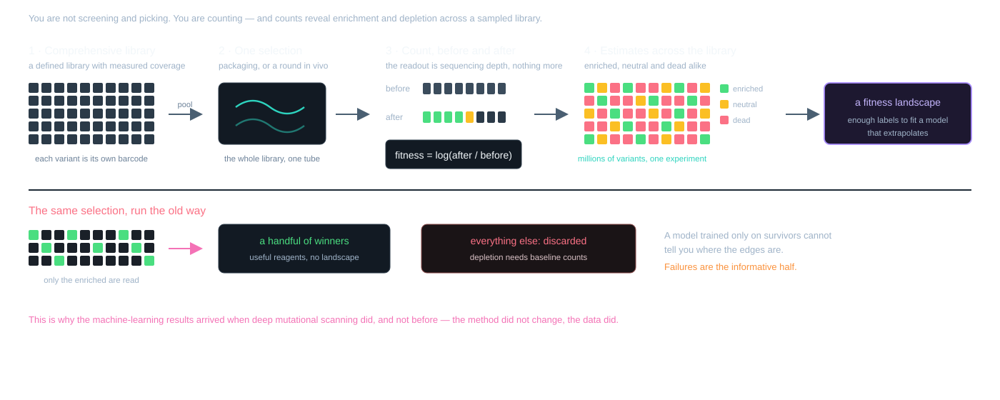{fig-alt="Deep mutational scanning compared with directed evolution. A comprehensive library containing every variant goes through one selection; the population is sequenced before and after, and each variant's fitness is the log ratio of its counts, so enrichment and depletion can be estimated for adequately sampled variants. Directed evolution runs the same selection but reads only the enriched survivors and discards the failures."}
:::

[Counts before and after selection reveal both enrichment and depletion.]{.bang}

::: {.cite}
@ogden2019
:::

::: {.notes}
Spell out the mechanic, because it is what changed the field and it is simpler than people
expect.

You are not screening and picking. You are counting. Each variant carries its own sequence
as its barcode, so you read the whole population before and after selection, and the
log-ratio is the fitness. One experiment, the entire library, enrichment and depletion estimated for adequately sampled variants.
Missing output counts can indicate depletion but are limited by sampling depth.

That last point is the one to press. Selection hands you survivors. A fitness landscape
needs the failures too, because that is what tells the model where viability ends. This is
precisely why the ML results arrived when DMS did, and not before.
:::

## Machine-Guided Capsid Design {.k-magenta}

::: {.diagram}
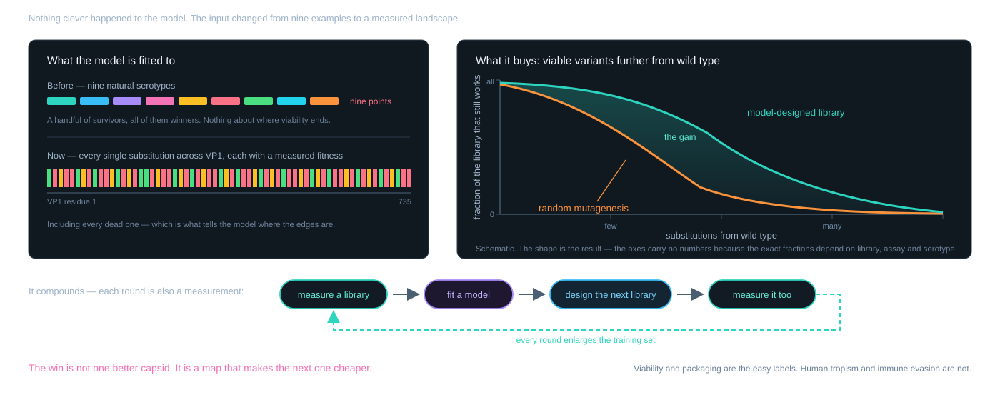{fig-alt="Machine-guided capsid design. The input changed from nine natural serotypes to a comprehensive measured landscape covering every single substitution across VP1. A schematic plot shows the fraction of a library that remains viable against substitutions from wild type: random mutagenesis collapses within a few substitutions while a model-designed library stays viable much further out. A loop underneath — measure, fit, design, measure again — notes that every round enlarges the training set."}
:::

[Sequence → fitness, learned rather than assumed.]{.bang}

::: {.cite}
@ogden2019; @bryant2021
:::

::: {.notes}
This is the slide that earns the title of the talk, and it closes the loop with *Two Genes in
the Same Sequence*.

The honest caveat if someone asks: viability and packaging are the easy labels. Tissue
tropism and immune evasion in humans are much harder to measure at library scale, and
that is where the field actually is.
:::

## Promoter Engineering: The Underrated Module {.k-magenta}

:::: {.columns}
::: {.column width="50%"}
The objective: express **only** in the target tissue, in as few bases as possible.

Every base here is a base not spent on the transgene.

Build from transcription-factor binding motifs and chromatin accessibility data rather
than borrowing a viral promoter.
:::
::: {.column width="50%"}
Why it matters beyond size:

- off-target expression is a safety problem
- ubiquitous promoters invite transgene-directed immunity
- a tissue-restricted promoter can replace a more exotic capsid

[Specificity bought with sequence instead of tropism.]{.bang}
:::
::::

::: {.cite}
@gray2011
:::

::: {.notes}
Promoters are the underrated module. The instinct is to solve targeting with the capsid,
but a liver-restricted promoter achieves much of the same thing far more cheaply, and it
composes with whatever capsid you already have.

The design problem is a regulatory-grammar one: which motifs, in what order, at what
spacing, in what chromatin context. There is a lot of transferable work from the broader
genomics literature here — this is the module where the ML is least AAV-specific.
:::

## Synthetic Promoters That Work {.k-magenta}

:::: {.columns}
::: {.column width="52%"}
[[Michael Roberts]{.namecard-name}[Synpromics → AskBio → Bayer · now Chromatin Bioscience]{.namecard-role}]{.namecard}

Built promoters from screened **motif libraries** assembled into compact, tissue-selective
elements — rather than repurposing CMV or a native regulatory region.
:::
::: {.column width="48%"}
**AMT-191** — AAV5 carrying *GLA* for Fabry disease, under a Synpromics liver-selective
promoter.

Initial four-patient cohort: **27–208× mean normal** α-Gal A activity.
Sponsor report, July 2025 data cutoff.

[A designed promoter, not a borrowed one.]{.bang}
:::
::::

::: {.cite}
@uniqure2025
:::

::: {.notes}
This is the concrete answer to "does promoter engineering actually deliver", and it is
worth having a number.

Synpromics' approach was to assemble promoters from screened motif libraries rather than
repurposing CMV or a native regulatory region — compact, liver-selective, and designed to
be strong enough that you can drop the dose.

This is a dated, sponsor-reported biomarker result in four patients, not an estimate
of clinical benefit or a controlled comparison of promoters. It does not isolate
the contribution of the promoter from dose, capsid and other cassette elements.
Do not interpret high enzyme activity alone as evidence of safety or durable benefit.
:::

## Why CpG Reads as Danger {.k-magenta}

::: {.diagram}
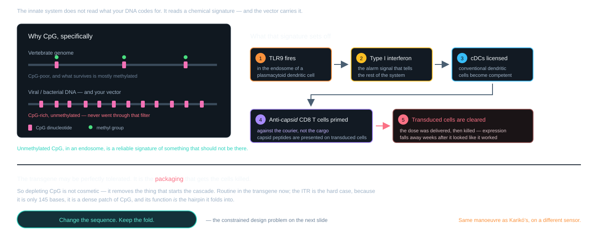{fig-alt="Why CpG reads as danger. Vertebrate DNA is CpG-poor and mostly methylated where CpG remains, while viral and bacterial DNA is CpG-rich and unmethylated, so unmethylated CpG inside an endosome is a signature of non-self. A five-step cascade follows: TLR9 fires in a plasmacytoid dendritic cell, type I interferon is released, conventional dendritic cells are licensed, anti-capsid CD8 T cells are primed, and transduced cells are cleared."}
:::

[The innate signal is what turns a delivery event into an immune response.]{.bang}

::: {.cite}
@faust2013; @mingozzi2013
:::

::: {.notes}
This is the mechanistic bridge between the manufacturing/immunology act and the ITR
design problem, and it is the same logic as the Karikó slide at the start.

Why CpG specifically: over evolutionary time, methylated cytosine deaminates to thymine,
so vertebrate genomes have been depleted of CpG and the survivors are mostly methylated.
Bacterial and viral genomes have not been through that filter. So the dinucleotide, in the
wrong compartment and unmethylated, is a genuine discriminator of non-self.

The chain to emphasise: this is an *innate* signal that ends in an *adaptive* response
against the capsid. The transgene may be perfectly tolerated — it is the packaging that
gets the cells killed.

So reducing CpG is not cosmetic. It is removing the thing that starts the cascade.
:::

## ITR Engineering: Change the Sequence, Keep the Fold {.k-magenta .webonly}

:::: {.columns}
::: {.column width="36%" .tight}
The hardest module. The ITR must still fold into the hairpin **Rep** nicks.

And it is a dense patch of **CpG** — the motif TLR9 reads as "infection".

145 bases, and every change is a large fraction of them.
:::
::: {.column width="64%"}
::: {.viz-stage data-viz="itrcpg" data-prevent-swipe="true" style="height:560px"}
:::
:::
::::

::: {.cite}
@faust2013
:::

::: {.notes}
Pull the thread from the dose-ceiling act. Unmethylated CpG dinucleotides are a pathogen
signature; TLR9 in plasmacytoid dendritic cells reads them, drives type I interferon, and
that licenses the anti-capsid CD8 response that clears transduced cells.

Depleting CpG from the transgene is routine now. The ITR is harder for two reasons: it is
only 145 bases so every change is a large fraction of it, and its function *is* its
secondary structure — a palindrome that has to fold into a T-shaped hairpin with a
terminal resolution site Rep can nick.

So this is a constrained design problem in the strict sense: minimise CpG count subject
to a fold constraint and a protein-recognition constraint. Very little prior art, and a
natural fit for generative models with hard constraints.
:::

## Where This Goes {.k-magenta}

:::: {.columns}
::: {.column width="50%"}
The binding constraint is the **dose ceiling**.

A better capsid reaches the same effect at a lower dose — below the toxicity curve, below
the T cell threshold, and cheaper to make.

One objective, three problems solved.
:::
::: {.column width="50%"}
What would actually move the field:

- labels that mean **human** tropism
- models that transfer across serotypes
- immune evasion as a trainable objective
- a regulatory path for sequences with no natural counterpart
:::
::::

[The biology set the constraints. What is left is a search problem.]{.bang}

::: {.cite}
@ogden2019; @eid2024
:::

::: {.notes}
Close on the argument, not a list of adjectives.

The shape of the whole talk: AAV's defectiveness made it a good vector; being a good
vector meant giving up integration; episomal persistence means the dose has to work the
first time; the dose is bounded by immunology; and the only lever that moves is potency
per particle.

Machine learning is in this talk because that is the lever, and the space is too large to
search by hand.

The honest limitation to end on: the models are good at predicting whether a capsid
assembles and packages. They are not yet good at predicting what it does in a human
liver. Closing that gap is the actual frontier.
:::

## References {.scrollable .smaller}

::: {#refs}
:::

## Credits {.smaller .k-teal}

:::: {.columns}
::: {.column width="50%"}
**Structures** — RCSB PDB. AAV2 [1LP3](https://www.rcsb.org/structure/1LP3), AAV9
[3UX1](https://www.rcsb.org/structure/3UX1). Icosahedral assemblies expanded in-browser
from the deposited asymmetric units.

**Software** — [three.js](https://threejs.org) and [NGL Viewer](https://nglviewer.org),
both MIT, vendored into this repository.

**Diagrams** — drawn for this deck; MIT with the rest of the source.
:::
::: {.column width="50%"}
**Portraits** — via Wikimedia Commons. **CC BY-SA 4.0**:

- Uğur Şahin, Özlem Türeci — © BioNTech SE
- Katalin Karikó — © University of Szeged

Public domain: Jimmy Carter — Lauren Gerson, LBJ Presidential Library, 2014.

**Plate** — Duchenne de Boulogne (1868), public domain.

**No photograph of an identifiable patient appears here without their own disclosure.**
President Carter announced his diagnosis and his treatment publicly, himself. The
Duchenne figure is an 1868 engraving, not a photograph of a living child.
:::
::::

::: {.notes}
Keep this slide. CC BY-SA 4.0 requires attribution and a licence statement, and the
portraits of Şahin, Türeci and Karikó are all under it.

The last line is deliberate. Using a real, identifiable patient's photograph — especially
a child's — in a conference talk needs explicit consent that a slide deck cannot
evidence. The 1868 engraving carries the same clinical point with none of that problem.

Carter is the one exception and it is a principled one: he held press conferences about
his own diagnosis, his own treatment and his own scans. That is disclosure by the
patient, not disclosure about a patient.
:::

# Questions {.act .k-teal}

::: {.notes}
Likely questions:

- *Why not redose?* The antibody response to dose one blocks it. Plasmapheresis and IgG
  proteases are being tried.
- *Why not integrate deliberately?* Insertional mutagenesis; and rAAV integration is
  largely non-targeted anyway. Nucleases and base editors are the other answer.
- *How real is DRG toxicity?* Consistent across NHP studies, dose dependent, often
  subclinical but histologically unambiguous.
- *Does generative design beat directed evolution?* On viability at distance, yes. On
  human tropism, not yet demonstrated.
- *Why is MAAP interesting?* It is the clearest case of ML on sequence data revealing
  biology rather than just optimising it.
:::
